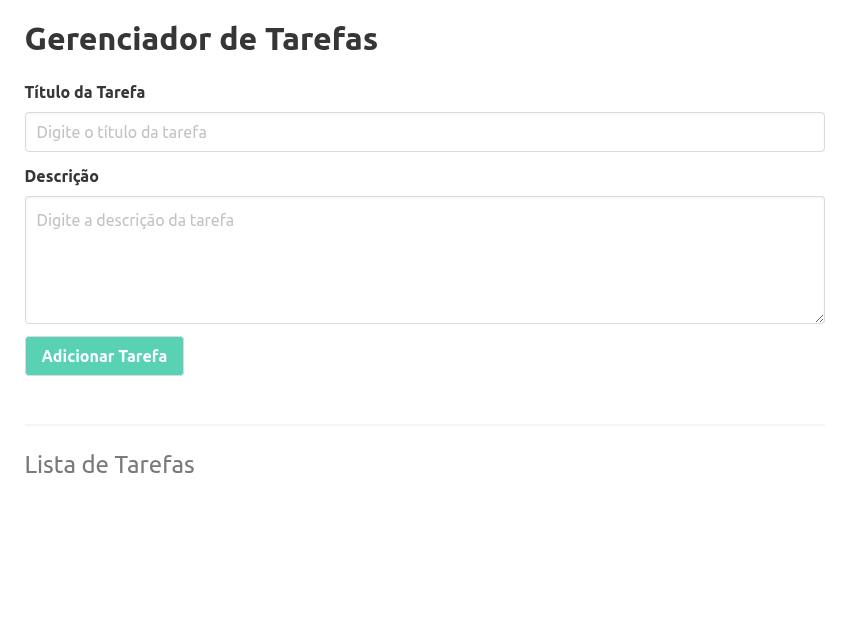
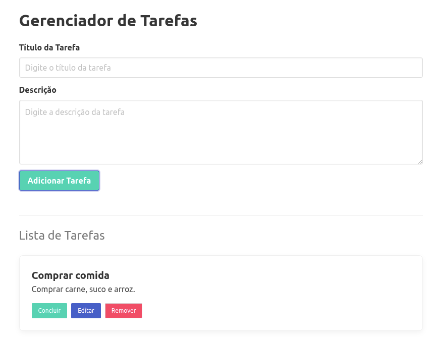

# Gerenciador de Tarefas Simples

Aplicação web simples para gerenciamento de tarefas, desenvolvida com HTML, CSS (Bulma) e JavaScript puro.

## Sobre o projeto

Este projeto permite adicionar e visualizar tarefas de forma prática, com uma interface limpa e objetiva.

## Funcionalidades

- Adicionar nova tarefa com título e descrição.
- Exibir a lista de tarefas cadastradas.
- Interface amigável e responsiva.

## Tecnologias utilizadas

- HTML5
- CSS3
- Bulma
- JavaScript (Vanilla JS)

## Estrutura do projeto

```text
.
|-- index.html
|-- script.js
|-- README.md
`-- img/
	|-- 1.png
	`-- 2.png
```

## Como executar

1. Clone este repositório.
2. Abra a pasta do projeto.
3. Execute o arquivo `index.html` no navegador.

## Capturas de tela

### Interface padrão



### Após inserção de uma tarefa



## Autor

Desenvolvido por Manoel Reis.
